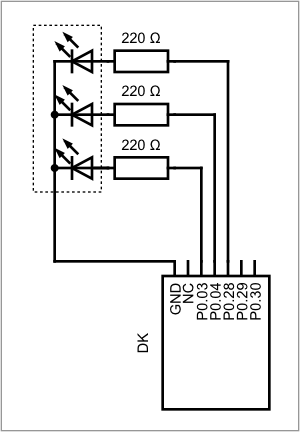

# External RGB LED

## Required Components

* 1 RGB LED
* 3 220 Ohm Resistors
* Breadboard
* Jumper cables

## Wiring

❗️❗️❗️ Before you start to wire things up, make sure, your breadboard and the nRF52840-DK is disconnected from any power source. 
 
We have provided two ways that depict the wiring of this setup:

A circuit diagram which is focused on showing what parts are connected in what ways. This type of diagram neglects physical appearance of the parts and how the parts arranged in the physical world. 

The breadboard diagram focuses on appearance of the parts and how they are arranged on a breadboard, while still showing the correct wiring. 

 

✅ Compare both diagrams for how they depict the RGB LED.

✅ Wire the parts according to the breadboard diagram. 

The longest leg of the LED ist connected to ground. The single leg on one side is the red channel, on the other side are the channels for green and blue. 

✅ Double check your work before connecting the board to the computer. 

## Code

You can either work on the same file from the hello world example, or work on a copy of it. We asume, that you have access to the p0 pins. In the first example, we configured one pin. That one pin was special in the sense, that it only gives access to one of the onboard LEDs. Now we need three [GPIO](/knowledge.html#gpio) pins, one for red, one for blue one for green.

1. Configute three gpio pins, P0.03, P0.04 and P0.28 into [push-pull-output](/knowledge.html#push-pull-output) pins, the initial level is LOW. 

2. Implement a blinking Loop. 

3. Define different presets for the LED. 

4. Play with switching between different presets of the LED. 

