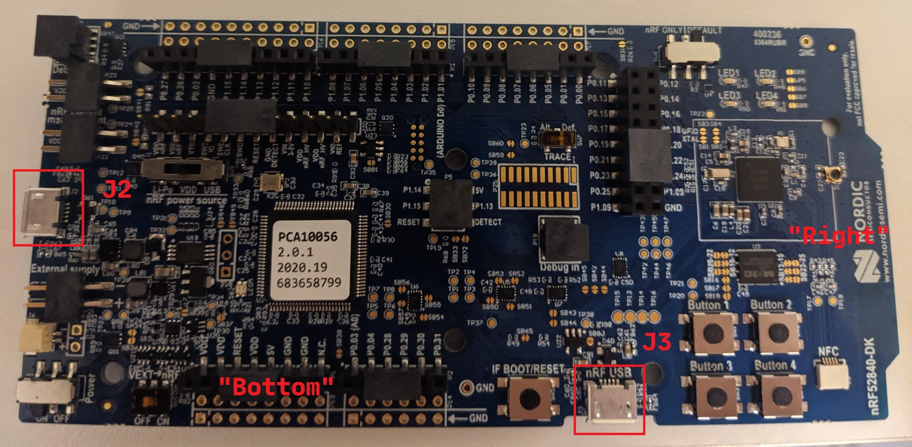

# Checking the Hardware

## nRF52840 Development Kit (DK)

Connect one end of a micro USB cable to the USB connector **J2** of the board and the other end to your PC.

💬 These directions assume you are holding the board "horizontally" with components (switches, buttons and pins) facing up. In this position, rotate the board, so that its convex shaped short side faces right. You'll find one USB connector (J2) on the left edge, another USB connector (J3) on the bottom edge and 4 buttons on the bottom right corner.




After connecting the DK to your PC/laptop it will show up as:

**Windows**: a removable USB flash drive (named JLINK) and also as a USB Serial Device (COM port) in the Device Manager under the Ports section

**Linux**: a USB device under `lsusb`. The device will have a VID of `0x1366` and a PID of `0x1015`  -- the `0x` prefix will be omitted in the output of `lsusb`:

``` console
$ lsusb
(..)
Bus 001 Device 014: ID 1366:1015 SEGGER 4-Port USB 2.0 Hub
```

The device will also show up in the `/dev` directory as a `ttyACM` device:

``` console
$ ls /dev/ttyACM*
/dev/ttyACM0
```

**macOS**: a removable USB flash drive (named JLINK) in Finder and also a USB device named "J-Link" when executing `ioreg -p IOUSB -b -n "J-Link"`.

``` console
$ ioreg -p IOUSB -b -n "J-Link"
(...)
  | +-o J-Link@14300000  <class AppleUSBDevice, id 0x10000606a, registered, matched, active, busy 0 $
  |     {
  |       (...)
  |       "idProduct" = 4117
  |       (...)
  |       "USB Product Name" = "J-Link"
  |       (...)
  |       "USB Vendor Name" = "SEGGER"
  |       "idVendor" = 4966
  |       (...)
  |       "USB Serial Number" = "000683420803"
  |       (...)
  |     }
  |
```

The device will also show up in the `/dev` directory as `tty.usbmodem<USB Serial Number>`:

``` console
$ ls /dev/tty.usbmodem*
/dev/tty.usbmodem0006834208031
```

The board has several switches to configure its behavior. The out of the box configuration is the one we want. If the above instructions didn't work for you, position the board so that the Button descriptions are horizontal and check the position of the on-board switches:

- Switch SW6, on the top edge right corner, is set to the DEFAULT position; this is the right position of the two possible positions (nRF = DEFAULT).
- Switch SW7, which is slightly up and to the right of the center of the board, is set to the Def. position; this is the right position of the two possible positions (TRACE = Def.). Note that this switch is protected by Kapton tape.
- Switch SW8, on the bottom edge left corner, is set to the ON position; this is the left position of the two possible positions (Power = ON)
- Switch SW9, to the right the left edge USB connector (J2), is set to the VDD position; this is the center position of the three possible positions (nRF power source = VDD)
- Switch SW10, on the bottom edge left corner and to the right of the SW8 switch, is set to the OFF position; this is the left position of the two possible positions (VEXT -> nRF = OFF). Note that this switch is protected by Kapton tape.
